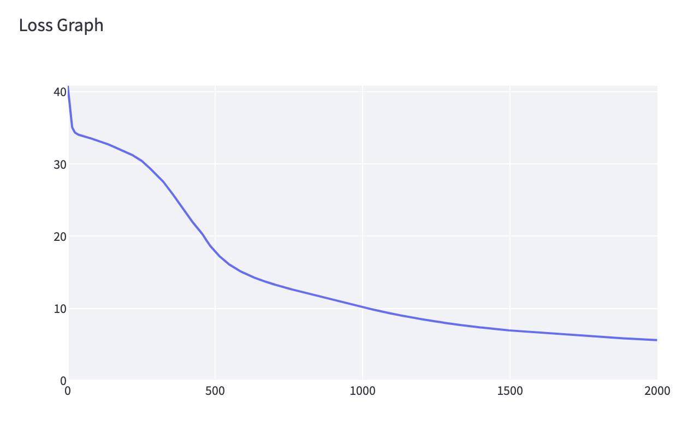

[](https://classroom.github.com/a/YFgwt0yY)

# MiniTorch Module 2


- Docs: https://minitorch.github.io/

- Overview: https://minitorch.github.io/module2/module2/

This assignment requires the following files from the previous assignments. You can get these by running

```bash
python sync_previous_module.py previous-module-dir current-module-dir
```

The files that will be synced are:

        minitorch/operators.py minitorch/module.py minitorch/autodiff.py minitorch/scalar.py minitorch/scalar_functions.py minitorch/module.py project/run_manual.py project/run_scalar.py project/datasets.py

## Task 2.5: Training

### Simple Dataset

#### Hyperparameters

- Learning Rate: 0.5
- Epochs: 500
- Size of Hidden Layer: 2

#### Result Image


#### Loss


```
Epoch: 0/500, loss: 0, correct: 0
Epoch: 10/500, loss: 32.48634136853034, correct: 31
Epoch: 20/500, loss: 31.43265161313937, correct: 31
Epoch: 30/500, loss: 28.95885277491663, correct: 31
Epoch: 40/500, loss: 24.634071002992105, correct: 31
Epoch: 50/500, loss: 19.48649121234393, correct: 43
Epoch: 60/500, loss: 14.99231541603437, correct: 46
Epoch: 70/500, loss: 11.777905020399128, correct: 46
Epoch: 80/500, loss: 14.873486446950313, correct: 42
Epoch: 90/500, loss: 9.369881723580015, correct: 45
Epoch: 100/500, loss: 7.934053368110915, correct: 46
Epoch: 110/500, loss: 7.730068191324754, correct: 46
Epoch: 120/500, loss: 8.336434750788792, correct: 45
Epoch: 130/500, loss: 6.377776637972967, correct: 46
Epoch: 140/500, loss: 5.658020872905179, correct: 46
Epoch: 150/500, loss: 5.19943059421096, correct: 47
Epoch: 160/500, loss: 4.786687871845502, correct: 47
Epoch: 170/500, loss: 4.39462142344698, correct: 47
Epoch: 180/500, loss: 4.064193779113316, correct: 49
Epoch: 190/500, loss: 3.7600545912913916, correct: 50
Epoch: 200/500, loss: 2.9548733864913004, correct: 50
Epoch: 210/500, loss: 2.2622053857273006, correct: 50
Epoch: 220/500, loss: 2.070971164200275, correct: 50
Epoch: 230/500, loss: 1.9322274728098472, correct: 50
Epoch: 240/500, loss: 1.809777712600652, correct: 50
Epoch: 250/500, loss: 1.7003227856468632, correct: 50
Epoch: 260/500, loss: 1.6017358888176136, correct: 50
Epoch: 270/500, loss: 1.5124739820504143, correct: 50
Epoch: 280/500, loss: 1.4311976801671797, correct: 50
Epoch: 290/500, loss: 1.3568322304104243, correct: 50
Epoch: 300/500, loss: 1.2886946363430853, correct: 50
Epoch: 310/500, loss: 1.2258844491049599, correct: 50
Epoch: 320/500, loss: 1.1678885164103776, correct: 50
Epoch: 330/500, loss: 1.1141392548228637, correct: 50
Epoch: 340/500, loss: 1.0642535666433335, correct: 50
Epoch: 350/500, loss: 1.0178822390501432, correct: 50
Epoch: 360/500, loss: 0.974648078333865, correct: 50
Epoch: 370/500, loss: 0.934293487463361, correct: 50
Epoch: 380/500, loss: 0.8965859994024028, correct: 50
Epoch: 390/500, loss: 0.8612916201726014, correct: 50
Epoch: 400/500, loss: 0.828196026061922, correct: 50
Epoch: 410/500, loss: 0.7971319985188076, correct: 50
Epoch: 420/500, loss: 0.7679033381438719, correct: 50
Epoch: 430/500, loss: 0.7403912137941828, correct: 50
Epoch: 440/500, loss: 0.714493499786163, correct: 50
Epoch: 450/500, loss: 0.6900466396392306, correct: 50
Epoch: 460/500, loss: 0.666960180000257, correct: 50
Epoch: 470/500, loss: 0.6451358461713496, correct: 50
Epoch: 480/500, loss: 0.6244586144909224, correct: 50
Epoch: 490/500, loss: 0.6048624600504269, correct: 50
Epoch: 500/500, loss: 0.5862849801072029, correct: 50
```

### Diagonal Dataset

#### Hyperparameters

- Learning Rate: 0.5
- Epochs: 500
- Size of Hidden Layer: 2

#### Result Image


#### Loss


```
Epoch: 0/500, loss: 0, correct: 0
Epoch: 10/500, loss: 18.932165039954707, correct: 42
Epoch: 20/500, loss: 17.21968167611561, correct: 42
Epoch: 30/500, loss: 14.953060684659093, correct: 42
Epoch: 40/500, loss: 12.226749806304454, correct: 42
Epoch: 50/500, loss: 9.548379632783327, correct: 46
Epoch: 60/500, loss: 7.994854011489032, correct: 46
Epoch: 70/500, loss: 6.883089144469621, correct: 47
Epoch: 80/500, loss: 5.964389887636887, correct: 50
Epoch: 90/500, loss: 5.19132903246061, correct: 50
Epoch: 100/500, loss: 4.52955287135163, correct: 50
Epoch: 110/500, loss: 4.001776109737448, correct: 50
Epoch: 120/500, loss: 3.519895951452921, correct: 50
Epoch: 130/500, loss: 3.112382052339363, correct: 50
Epoch: 140/500, loss: 2.773483776220745, correct: 50
Epoch: 150/500, loss: 2.4844674745450486, correct: 50
Epoch: 160/500, loss: 2.2370703795414415, correct: 50
Epoch: 170/500, loss: 2.0245392208205573, correct: 50
Epoch: 180/500, loss: 1.84127707531321, correct: 50
Epoch: 190/500, loss: 1.694119790523422, correct: 50
Epoch: 200/500, loss: 1.5695509953272624, correct: 50
Epoch: 210/500, loss: 1.451705489388023, correct: 50
Epoch: 220/500, loss: 1.3480798016374036, correct: 50
Epoch: 230/500, loss: 1.2563856737069743, correct: 50
Epoch: 240/500, loss: 1.1748840912305554, correct: 50
Epoch: 250/500, loss: 1.1021257249209062, correct: 50
Epoch: 260/500, loss: 1.03689844233477, correct: 50
Epoch: 270/500, loss: 0.9781852668307577, correct: 50
Epoch: 280/500, loss: 0.925130198557363, correct: 50
Epoch: 290/500, loss: 0.8770102655343925, correct: 50
Epoch: 300/500, loss: 0.8332126334879206, correct: 50
Epoch: 310/500, loss: 0.7932158566089973, correct: 50
Epoch: 320/500, loss: 0.7565745194624987, correct: 50
Epoch: 330/500, loss: 0.7229066499341266, correct: 50
Epoch: 340/500, loss: 0.6918833909237633, correct: 50
Epoch: 350/500, loss: 0.6630152554052059, correct: 50
Epoch: 360/500, loss: 0.6263109502054648, correct: 50
Epoch: 370/500, loss: 0.6102550503602953, correct: 50
Epoch: 380/500, loss: 0.5796340277412857, correct: 50
Epoch: 390/500, loss: 0.5655958048784702, correct: 50
Epoch: 400/500, loss: 0.5390829667894709, correct: 50
Epoch: 410/500, loss: 0.526669927917098, correct: 50
Epoch: 420/500, loss: 0.5041299323275743, correct: 50
Epoch: 430/500, loss: 0.4919468944656179, correct: 50
Epoch: 440/500, loss: 0.47044367293557005, correct: 50
Epoch: 450/500, loss: 0.45827535608795505, correct: 50
Epoch: 460/500, loss: 0.4424653185770984, correct: 50
Epoch: 470/500, loss: 0.4346895253757906, correct: 50
Epoch: 480/500, loss: 0.41802798438960326, correct: 50
Epoch: 490/500, loss: 0.4064311266502746, correct: 50
Epoch: 500/500, loss: 0.39532287487946755, correct: 50
```

### Split Dataset

#### Hyperparameters

- Learning Rate: 0.1
- Epochs: 1000
- Size of Hidden Layer: 4

#### Result Image


#### Loss


```
Epoch: 10/1000, loss: 34.6522401781885, correct: 22
Epoch: 20/1000, loss: 34.35784505455049, correct: 25
Epoch: 30/1000, loss: 34.119603969252616, correct: 26
Epoch: 40/1000, loss: 33.93230742708621, correct: 28
Epoch: 50/1000, loss: 33.77175526852359, correct: 31
Epoch: 60/1000, loss: 33.63687984524522, correct: 32
Epoch: 70/1000, loss: 33.50618975085797, correct: 38
Epoch: 80/1000, loss: 33.3677873744298, correct: 38
Epoch: 90/1000, loss: 33.215304541788626, correct: 43
Epoch: 100/1000, loss: 33.04688017283939, correct: 43
Epoch: 110/1000, loss: 32.860714332362576, correct: 44
Epoch: 120/1000, loss: 32.65524063270272, correct: 47
Epoch: 130/1000, loss: 32.428720222761406, correct: 47
Epoch: 140/1000, loss: 32.179363364002995, correct: 46
Epoch: 150/1000, loss: 31.905169471179775, correct: 43
Epoch: 160/1000, loss: 31.60386234925632, correct: 42
Epoch: 170/1000, loss: 31.274002682366074, correct: 41
Epoch: 180/1000, loss: 30.916648005413858, correct: 37
Epoch: 190/1000, loss: 30.544022675107875, correct: 38
Epoch: 200/1000, loss: 30.184991866235837, correct: 38
Epoch: 210/1000, loss: 29.817047610357317, correct: 39
Epoch: 220/1000, loss: 29.43420068378947, correct: 40
Epoch: 230/1000, loss: 29.019213231828687, correct: 40
Epoch: 240/1000, loss: 28.575580114188384, correct: 39
Epoch: 250/1000, loss: 28.103632930024105, correct: 39
Epoch: 260/1000, loss: 27.594433571143682, correct: 40
Epoch: 270/1000, loss: 26.99607704722415, correct: 40
Epoch: 280/1000, loss: 26.316447943253507, correct: 41
Epoch: 290/1000, loss: 25.566046849266886, correct: 41
Epoch: 300/1000, loss: 24.762414052614275, correct: 42
Epoch: 310/1000, loss: 23.944985592806603, correct: 44
Epoch: 320/1000, loss: 23.096102032229254, correct: 47
Epoch: 330/1000, loss: 22.172422147846376, correct: 48
Epoch: 340/1000, loss: 21.166208859836754, correct: 48
Epoch: 350/1000, loss: 20.096415883761043, correct: 49
Epoch: 360/1000, loss: 19.073651097215617, correct: 49
Epoch: 370/1000, loss: 18.111257685594307, correct: 49
Epoch: 380/1000, loss: 17.167965163109695, correct: 49
Epoch: 390/1000, loss: 16.25418733582439, correct: 49
Epoch: 400/1000, loss: 15.413928360004162, correct: 49
Epoch: 410/1000, loss: 14.621828702150948, correct: 50
Epoch: 420/1000, loss: 13.875484612626119, correct: 50
Epoch: 430/1000, loss: 13.164659401268034, correct: 50
Epoch: 440/1000, loss: 12.491087826452198, correct: 50
Epoch: 450/1000, loss: 11.855663193975419, correct: 50
Epoch: 460/1000, loss: 11.258389149925721, correct: 49
Epoch: 470/1000, loss: 10.698579129225918, correct: 49
Epoch: 480/1000, loss: 10.175047883031766, correct: 49
Epoch: 490/1000, loss: 9.691702136157868, correct: 49
Epoch: 500/1000, loss: 9.246474824697476, correct: 49
Epoch: 510/1000, loss: 8.832319162179813, correct: 49
Epoch: 520/1000, loss: 8.445349909494915, correct: 49
Epoch: 530/1000, loss: 8.084533488903695, correct: 49
Epoch: 540/1000, loss: 7.749737815823985, correct: 50
Epoch: 550/1000, loss: 7.437719028087741, correct: 49
Epoch: 560/1000, loss: 7.146338575857278, correct: 50
Epoch: 570/1000, loss: 6.875494709155332, correct: 50
Epoch: 580/1000, loss: 6.6224361458152625, correct: 50
Epoch: 590/1000, loss: 6.385857520072793, correct: 50
Epoch: 600/1000, loss: 6.164727341334605, correct: 50
Epoch: 610/1000, loss: 5.9573549855431125, correct: 50
Epoch: 620/1000, loss: 5.762586418388242, correct: 50
Epoch: 630/1000, loss: 5.57943370234146, correct: 50
Epoch: 640/1000, loss: 5.406993369719136, correct: 50
Epoch: 650/1000, loss: 5.244440340770799, correct: 50
Epoch: 660/1000, loss: 5.09105840939722, correct: 50
Epoch: 670/1000, loss: 4.946210116872614, correct: 50
Epoch: 680/1000, loss: 4.809194874424192, correct: 50
Epoch: 690/1000, loss: 4.679910355060789, correct: 50
Epoch: 700/1000, loss: 4.557563570910406, correct: 50
Epoch: 710/1000, loss: 4.4414519533357835, correct: 50
Epoch: 720/1000, loss: 4.3312881848693285, correct: 50
Epoch: 730/1000, loss: 4.226473430086876, correct: 50
Epoch: 740/1000, loss: 4.12664166065204, correct: 50
Epoch: 750/1000, loss: 4.031323334796839, correct: 50
Epoch: 760/1000, loss: 3.9403776571523896, correct: 50
Epoch: 770/1000, loss: 3.8531397744369826, correct: 50
Epoch: 780/1000, loss: 3.7697394389094887, correct: 50
Epoch: 790/1000, loss: 3.689812286185788, correct: 50
Epoch: 800/1000, loss: 3.6131446525947775, correct: 50
Epoch: 810/1000, loss: 3.5395440528428126, correct: 50
Epoch: 820/1000, loss: 3.4688164121661567, correct: 50
Epoch: 830/1000, loss: 3.4007891451376144, correct: 50
Epoch: 840/1000, loss: 3.3353059256847257, correct: 50
Epoch: 850/1000, loss: 3.2721879841999297, correct: 50
Epoch: 860/1000, loss: 3.2112275808796253, correct: 50
Epoch: 870/1000, loss: 3.152435133178651, correct: 50
Epoch: 880/1000, loss: 3.0957242452913785, correct: 50
Epoch: 890/1000, loss: 3.0409647816329453, correct: 50
Epoch: 900/1000, loss: 2.9880333112965056, correct: 50
Epoch: 910/1000, loss: 2.936839655619074, correct: 50
Epoch: 920/1000, loss: 2.887292581234477, correct: 50
Epoch: 930/1000, loss: 2.8393039519162553, correct: 50
Epoch: 940/1000, loss: 2.792798918905352, correct: 50
Epoch: 950/1000, loss: 2.7477071278293987, correct: 50
Epoch: 960/1000, loss: 2.7039684235566575, correct: 50
Epoch: 970/1000, loss: 2.661519783269062, correct: 50
Epoch: 980/1000, loss: 2.620310274739843, correct: 50
Epoch: 990/1000, loss: 2.5802711880152214, correct: 50
Epoch: 1000/1000, loss: 2.541351399271295, correct: 50
```

### XOR Dataset

#### Hyperparameters

- Learning Rate: 0.1
- Epochs: 2000
- Size of Hidden Layer: 4

#### Result Image


#### Loss



```
Epoch: 0/2000, loss: 0, correct: 0
Epoch: 10/2000, loss: 36.51737723029018, correct: 25
Epoch: 20/2000, loss: 34.68239267015535, correct: 26
Epoch: 30/2000, loss: 34.19729018551173, correct: 30
Epoch: 40/2000, loss: 34.002767607244905, correct: 27
Epoch: 50/2000, loss: 33.87803655871178, correct: 27
Epoch: 60/2000, loss: 33.762709252186305, correct: 28
Epoch: 70/2000, loss: 33.64565658666818, correct: 29
Epoch: 80/2000, loss: 33.52818268036981, correct: 29
Epoch: 90/2000, loss: 33.40605938587388, correct: 29
Epoch: 100/2000, loss: 33.27734287923886, correct: 29
Epoch: 110/2000, loss: 33.140662683444006, correct: 30
Epoch: 120/2000, loss: 32.994707535672035, correct: 31
Epoch: 130/2000, loss: 32.83914356584716, correct: 32
Epoch: 140/2000, loss: 32.68441933166398, correct: 32
Epoch: 150/2000, loss: 32.519348159080074, correct: 32
Epoch: 160/2000, loss: 32.347652345181515, correct: 32
Epoch: 170/2000, loss: 32.176750877973305, correct: 32
Epoch: 180/2000, loss: 31.998431463445744, correct: 32
Epoch: 190/2000, loss: 31.817217690622996, correct: 32
Epoch: 200/2000, loss: 31.631801581227887, correct: 32
Epoch: 210/2000, loss: 31.436301378765915, correct: 32
Epoch: 220/2000, loss: 31.22693071609582, correct: 33
Epoch: 230/2000, loss: 30.999021674454223, correct: 33
Epoch: 240/2000, loss: 30.750511819615095, correct: 33
Epoch: 250/2000, loss: 30.47388891711413, correct: 34
Epoch: 260/2000, loss: 30.15216652840517, correct: 34
Epoch: 270/2000, loss: 29.770590769956147, correct: 35
Epoch: 280/2000, loss: 29.380119521133746, correct: 36
Epoch: 290/2000, loss: 29.01287051615019, correct: 40
Epoch: 300/2000, loss: 28.63693797972769, correct: 42
Epoch: 310/2000, loss: 28.225497644611014, correct: 42
Epoch: 320/2000, loss: 27.776745039392345, correct: 42
Epoch: 330/2000, loss: 27.292553227771855, correct: 44
Epoch: 340/2000, loss: 26.78050245571952, correct: 45
Epoch: 350/2000, loss: 26.227834550531874, correct: 45
Epoch: 360/2000, loss: 25.64893671857642, correct: 45
Epoch: 370/2000, loss: 25.048715881770658, correct: 45
Epoch: 380/2000, loss: 24.432890570019676, correct: 45
Epoch: 390/2000, loss: 23.814855011281495, correct: 44
Epoch: 400/2000, loss: 23.205739924853138, correct: 44
Epoch: 410/2000, loss: 22.68054957042803, correct: 44
Epoch: 420/2000, loss: 22.170686041339092, correct: 44
Epoch: 430/2000, loss: 21.66446826923867, correct: 44
Epoch: 440/2000, loss: 21.19555226391626, correct: 44
Epoch: 450/2000, loss: 20.679277936040783, correct: 44
Epoch: 460/2000, loss: 20.19460106696997, correct: 44
Epoch: 470/2000, loss: 19.51171925011938, correct: 44
Epoch: 480/2000, loss: 18.88292608361066, correct: 44
Epoch: 490/2000, loss: 18.37199888674243, correct: 44
Epoch: 500/2000, loss: 17.89575868639454, correct: 44
Epoch: 510/2000, loss: 17.45814425336475, correct: 44
Epoch: 520/2000, loss: 17.055744454057997, correct: 44
Epoch: 530/2000, loss: 16.68650154329238, correct: 44
Epoch: 540/2000, loss: 16.350176115431736, correct: 44
Epoch: 550/2000, loss: 16.049034872417035, correct: 44
Epoch: 560/2000, loss: 15.769999275237794, correct: 44
Epoch: 570/2000, loss: 15.516435198401485, correct: 44
Epoch: 580/2000, loss: 15.283780279244501, correct: 44
Epoch: 590/2000, loss: 15.064562896066382, correct: 44
Epoch: 600/2000, loss: 14.86041549169287, correct: 44
Epoch: 610/2000, loss: 14.671055488840341, correct: 44
Epoch: 620/2000, loss: 14.492953359369904, correct: 44
Epoch: 630/2000, loss: 14.323916750373101, correct: 44
Epoch: 640/2000, loss: 14.166128297069346, correct: 44
Epoch: 650/2000, loss: 14.012159822620532, correct: 45
Epoch: 660/2000, loss: 13.867609021125169, correct: 45
Epoch: 670/2000, loss: 13.726457034924962, correct: 45
Epoch: 680/2000, loss: 13.589602286403162, correct: 45
Epoch: 690/2000, loss: 13.460674288713735, correct: 45
Epoch: 700/2000, loss: 13.335939341541481, correct: 45
Epoch: 710/2000, loss: 13.214965140298697, correct: 45
Epoch: 720/2000, loss: 13.096918964535455, correct: 45
Epoch: 730/2000, loss: 12.980788241237763, correct: 45
Epoch: 740/2000, loss: 12.867613698037156, correct: 45
Epoch: 750/2000, loss: 12.75587841548022, correct: 45
Epoch: 760/2000, loss: 12.646122569572173, correct: 45
Epoch: 770/2000, loss: 12.537325712800033, correct: 45
Epoch: 780/2000, loss: 12.42952726034622, correct: 45
Epoch: 790/2000, loss: 12.323422290116048, correct: 45
Epoch: 800/2000, loss: 12.217471091673708, correct: 45
Epoch: 810/2000, loss: 12.112454839449244, correct: 45
Epoch: 820/2000, loss: 12.007778578976346, correct: 45
Epoch: 830/2000, loss: 11.903403156119888, correct: 46
Epoch: 840/2000, loss: 11.799244015032409, correct: 46
Epoch: 850/2000, loss: 11.695182756109897, correct: 46
Epoch: 860/2000, loss: 11.59119501146302, correct: 46
Epoch: 870/2000, loss: 11.48748317594992, correct: 46
Epoch: 880/2000, loss: 11.383949397069706, correct: 46
Epoch: 890/2000, loss: 11.280465408193775, correct: 46
Epoch: 900/2000, loss: 11.1771298568381, correct: 46
Epoch: 910/2000, loss: 11.073911451550881, correct: 46
Epoch: 920/2000, loss: 10.972012095614751, correct: 46
Epoch: 930/2000, loss: 10.870080314702955, correct: 46
Epoch: 940/2000, loss: 10.770070619340103, correct: 47
Epoch: 950/2000, loss: 10.66897896106173, correct: 47
Epoch: 960/2000, loss: 10.570549796669065, correct: 47
Epoch: 970/2000, loss: 10.47276623249382, correct: 47
Epoch: 980/2000, loss: 10.375463997643724, correct: 47
Epoch: 990/2000, loss: 10.278212946396742, correct: 47
Epoch: 1000/2000, loss: 10.180296749572056, correct: 47
Epoch: 1010/2000, loss: 10.08626944875887, correct: 47
Epoch: 1020/2000, loss: 9.990687559692802, correct: 47
Epoch: 1030/2000, loss: 9.899108209659806, correct: 47
Epoch: 1040/2000, loss: 9.807090262655775, correct: 47
Epoch: 1050/2000, loss: 9.714258442443631, correct: 47
Epoch: 1060/2000, loss: 9.623530328197235, correct: 47
Epoch: 1070/2000, loss: 9.535656748635743, correct: 47
Epoch: 1080/2000, loss: 9.44738747848799, correct: 47
Epoch: 1090/2000, loss: 9.359792975049173, correct: 48
Epoch: 1100/2000, loss: 9.280603150920685, correct: 48
Epoch: 1110/2000, loss: 9.19837415107544, correct: 48
Epoch: 1120/2000, loss: 9.117411667749396, correct: 48
Epoch: 1130/2000, loss: 9.037514540984029, correct: 48
Epoch: 1140/2000, loss: 8.959281675093976, correct: 48
Epoch: 1150/2000, loss: 8.884204761055939, correct: 48
Epoch: 1160/2000, loss: 8.809072273192234, correct: 48
Epoch: 1170/2000, loss: 8.731327495232431, correct: 48
Epoch: 1180/2000, loss: 8.658835271978864, correct: 48
Epoch: 1190/2000, loss: 8.590637613314046, correct: 48
Epoch: 1200/2000, loss: 8.520031960109092, correct: 48
Epoch: 1210/2000, loss: 8.454314683217229, correct: 48
Epoch: 1220/2000, loss: 8.381316342806805, correct: 48
Epoch: 1230/2000, loss: 8.316088564489029, correct: 48
Epoch: 1240/2000, loss: 8.250892560103773, correct: 48
Epoch: 1250/2000, loss: 8.18663110602325, correct: 48
Epoch: 1260/2000, loss: 8.122577112099187, correct: 48
Epoch: 1270/2000, loss: 8.061969296212483, correct: 48
Epoch: 1280/2000, loss: 8.000726149917172, correct: 49
Epoch: 1290/2000, loss: 7.940392584345129, correct: 49
Epoch: 1300/2000, loss: 7.883094247329047, correct: 49
Epoch: 1310/2000, loss: 7.824692804701112, correct: 49
Epoch: 1320/2000, loss: 7.773540463402875, correct: 49
Epoch: 1330/2000, loss: 7.719748792479018, correct: 49
Epoch: 1340/2000, loss: 7.666600971072833, correct: 49
Epoch: 1350/2000, loss: 7.615064270176473, correct: 49
Epoch: 1360/2000, loss: 7.564521350651792, correct: 49
Epoch: 1370/2000, loss: 7.514479605482123, correct: 49
Epoch: 1380/2000, loss: 7.46642549370303, correct: 49
Epoch: 1390/2000, loss: 7.418373143131855, correct: 49
Epoch: 1400/2000, loss: 7.371211669794426, correct: 49
Epoch: 1410/2000, loss: 7.321421692157264, correct: 49
Epoch: 1420/2000, loss: 7.276580770020524, correct: 49
Epoch: 1430/2000, loss: 7.232900541952859, correct: 49
Epoch: 1440/2000, loss: 7.190444606089009, correct: 49
Epoch: 1450/2000, loss: 7.147324629140586, correct: 49
Epoch: 1460/2000, loss: 7.106539201457427, correct: 49
Epoch: 1470/2000, loss: 7.065578940224155, correct: 49
Epoch: 1480/2000, loss: 7.02559146261361, correct: 49
Epoch: 1490/2000, loss: 6.986061181285346, correct: 49
Epoch: 1500/2000, loss: 6.948399470566112, correct: 49
Epoch: 1510/2000, loss: 6.910292622911433, correct: 49
Epoch: 1520/2000, loss: 6.873462578258146, correct: 49
Epoch: 1530/2000, loss: 6.837753965767279, correct: 49
Epoch: 1540/2000, loss: 6.801889224212533, correct: 49
Epoch: 1550/2000, loss: 6.767073054690391, correct: 49
Epoch: 1560/2000, loss: 6.7328084948284515, correct: 49
Epoch: 1570/2000, loss: 6.69963733439641, correct: 49
Epoch: 1580/2000, loss: 6.666467312688437, correct: 49
Epoch: 1590/2000, loss: 6.63372590045561, correct: 49
Epoch: 1600/2000, loss: 6.601165701416086, correct: 49
Epoch: 1610/2000, loss: 6.569498416895172, correct: 49
Epoch: 1620/2000, loss: 6.538656615158279, correct: 49
Epoch: 1630/2000, loss: 6.507963935465196, correct: 49
Epoch: 1640/2000, loss: 6.477084769867819, correct: 49
Epoch: 1650/2000, loss: 6.447573951666676, correct: 49
Epoch: 1660/2000, loss: 6.418086562006798, correct: 49
Epoch: 1670/2000, loss: 6.38850383456922, correct: 49
Epoch: 1680/2000, loss: 6.360187267911703, correct: 49
Epoch: 1690/2000, loss: 6.331405956748123, correct: 49
Epoch: 1700/2000, loss: 6.303653705972269, correct: 49
Epoch: 1710/2000, loss: 6.275981332370681, correct: 49
Epoch: 1720/2000, loss: 6.248966831076994, correct: 49
Epoch: 1730/2000, loss: 6.221584832552833, correct: 49
Epoch: 1740/2000, loss: 6.195440684423341, correct: 49
Epoch: 1750/2000, loss: 6.16905686720796, correct: 49
Epoch: 1760/2000, loss: 6.143568741707105, correct: 49
Epoch: 1770/2000, loss: 6.118430226277946, correct: 49
Epoch: 1780/2000, loss: 6.093638098809432, correct: 49
Epoch: 1790/2000, loss: 6.069120386487134, correct: 49
Epoch: 1800/2000, loss: 6.044858393910977, correct: 49
Epoch: 1810/2000, loss: 6.0209598677072576, correct: 49
Epoch: 1820/2000, loss: 5.997296390971012, correct: 49
Epoch: 1830/2000, loss: 5.9739361512401015, correct: 49
Epoch: 1840/2000, loss: 5.950894975248231, correct: 49
Epoch: 1850/2000, loss: 5.928071201590977, correct: 49
Epoch: 1860/2000, loss: 5.9055799833398, correct: 49
Epoch: 1870/2000, loss: 5.883310161721959, correct: 49
Epoch: 1880/2000, loss: 5.861351242947351, correct: 49
Epoch: 1890/2000, loss: 5.839641950313025, correct: 49
Epoch: 1900/2000, loss: 5.818158871048576, correct: 49
Epoch: 1910/2000, loss: 5.796990401659153, correct: 49
Epoch: 1920/2000, loss: 5.776021107000091, correct: 49
Epoch: 1930/2000, loss: 5.7553576729636955, correct: 49
Epoch: 1940/2000, loss: 5.734889650922567, correct: 49
Epoch: 1950/2000, loss: 5.714718789916854, correct: 49
Epoch: 1960/2000, loss: 5.6947391776952125, correct: 49
Epoch: 1970/2000, loss: 5.6750491733860295, correct: 49
Epoch: 1980/2000, loss: 5.655290427361795, correct: 49
Epoch: 1990/2000, loss: 5.636012398630015, correct: 49
Epoch: 2000/2000, loss: 5.616996379307516, correct: 49

```
